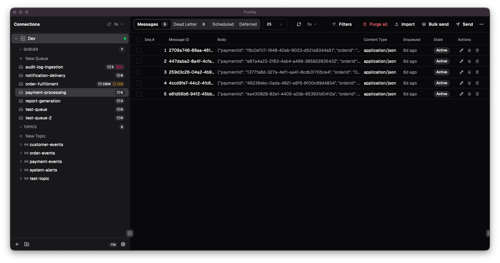
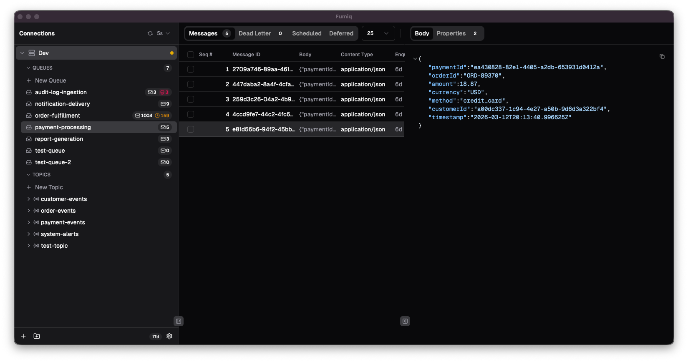
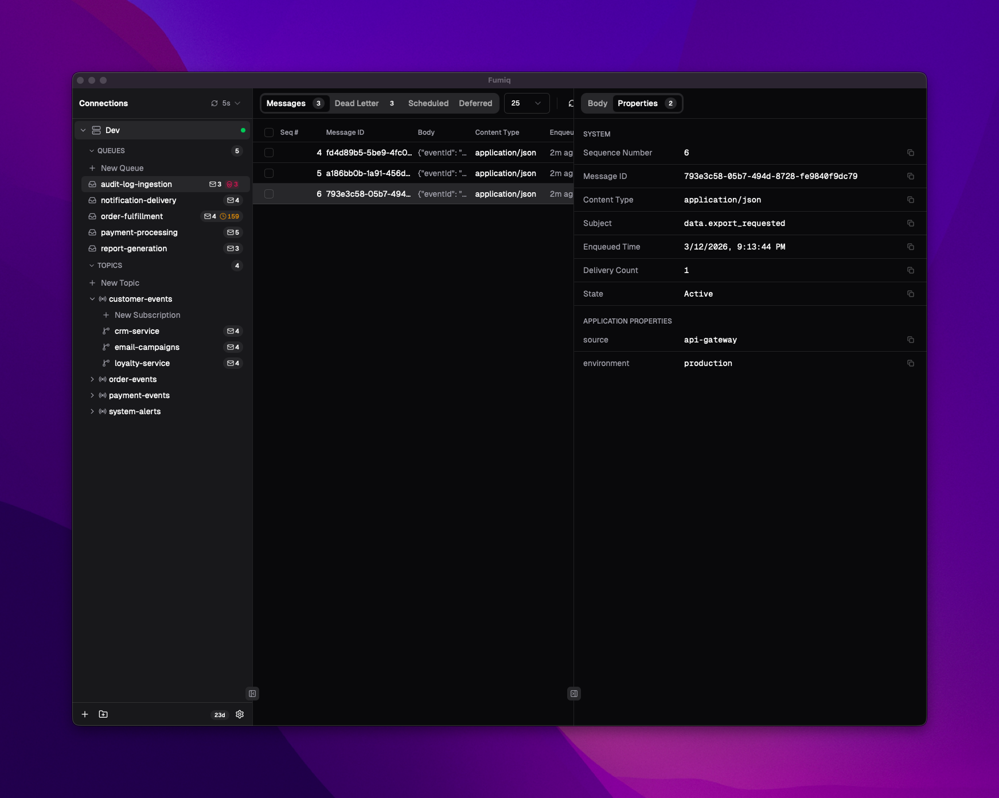
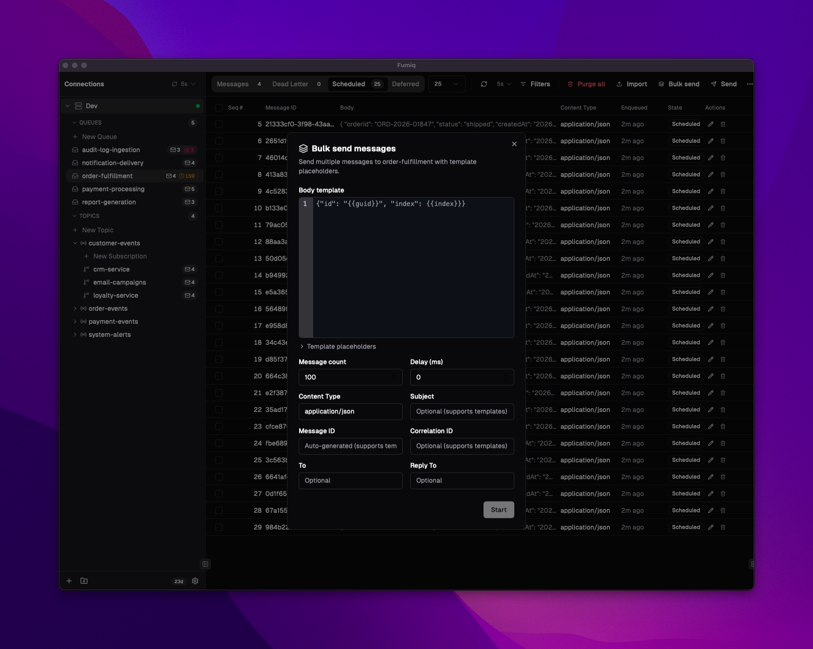
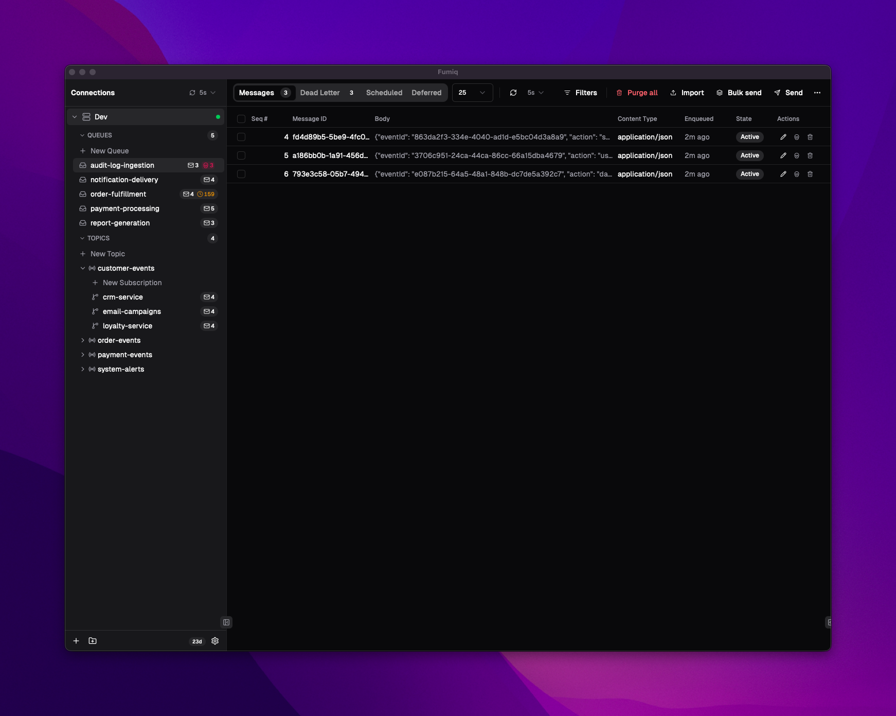
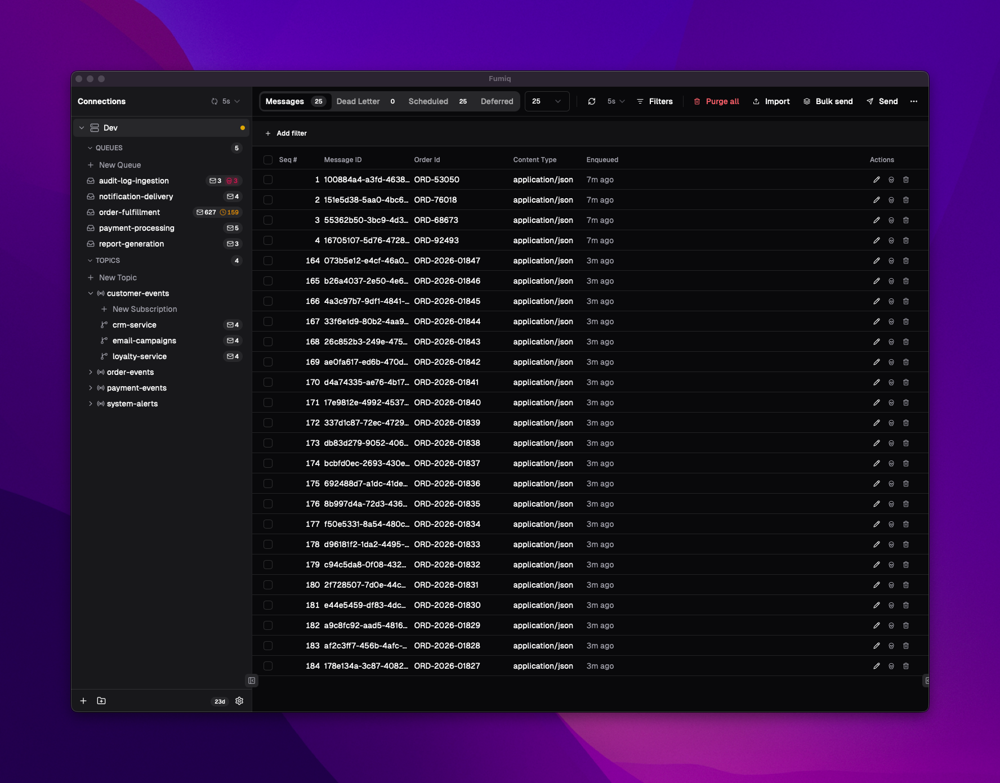
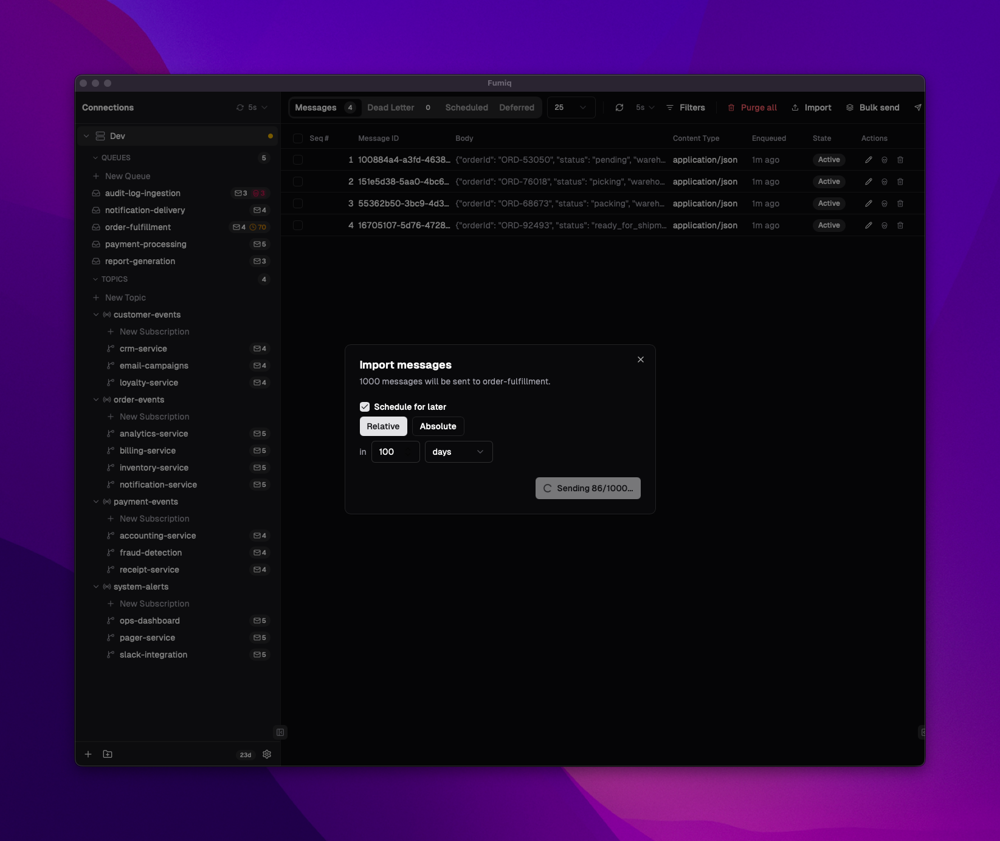
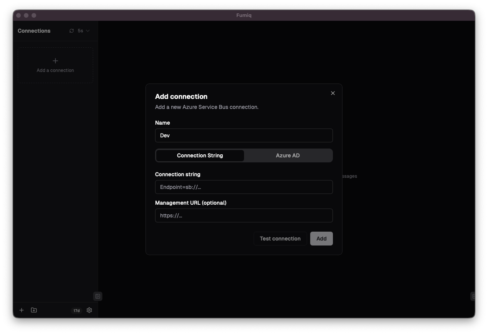
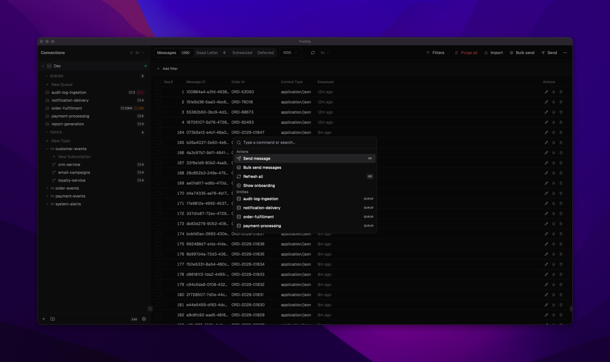

<div align="center">


# Fumiq

**One tool for all your queues.**

A fast, native, cross-platform desktop app for browsing, inspecting, and managing message queues.

macOS · Windows · Linux

</div>

---



Fumiq gives you fast, visual access to your message queues. Browse entities, peek messages with syntax highlighting, send and schedule messages, manage dead-letter queues, and more — all from a lightweight native app that runs on every platform.

## 🔌 Supported Providers

- **Azure Service Bus** — Full support for queues, topics, subscriptions, dead-letter queues, sessions, deferred messages, and more
- **RabbitMQ** — Coming soon
- **Kafka, Amazon SQS, Google Pub/Sub** — On the horizon

## ✨ Features

### 🌳 Browse & Inspect

- Entity tree with live message counts for queues, topics, and subscriptions
- Peek messages without consuming them
- JSON and XML syntax highlighting with collapsible tree view
- Full message property inspection (system, application, custom)
- Automatic stack trace detection and formatting





### 📨 Send & Schedule

- Send messages with full metadata (content type, correlation ID, custom properties, etc.)
- Schedule messages with relative or absolute delivery times
- Bulk send with template engine — define variables, generate sequences, stress-test queues



### 🔧 Repair & Resubmit

- Edit message body and properties, then resubmit
- Fix malformed payloads directly from the dead-letter queue
- Works from any tab — active messages, dead-letter queue, or deferred

### 💀 Dead Letter Management

- Browse, inspect, and resubmit dead-lettered messages
- View dead-letter reason and error descriptions
- Bulk delete and purge operations



### 🏗️ Entity Management

- Create, update, and delete queues, topics, and subscriptions
- Manage subscription filter rules with SQL and correlation filters

### 📋 Custom Columns & Filtering

- Add columns for application properties or extract values from JSON bodies using JSONPath
- Resize, reorder, and persist layouts per entity
- Filter messages with a visual query builder and 14+ operators



### 📦 Copy, Export & Import

- Copy messages between queues
- Export to JSON files or import messages from disk
- Move data across environments in seconds



### ⚡ Bulk Operations

- Select multiple messages with checkboxes or Shift+click ranges
- Bulk delete, dead-letter, resubmit, or cancel scheduled messages in one action

### 🔐 Authentication

- Connect with connection strings or Azure AD with RBAC
- Organize connections into folders with drag-and-drop



### 🎯 Advanced

- Session-aware browsing and message peeking
- Deferred message support
- Scheduled message management (view, cancel, purge)
- Auto-refresh with configurable intervals

### ⌨️ Keyboard-First

- Command palette (`Cmd+K` / `Ctrl+K`)
- Full keyboard navigation with shortcuts for all common actions
- Fast entity search



### 💻 Cross-Platform & Native

- macOS, Windows, and Linux
- Native performance with minimal memory footprint

## 📥 Installation

Download the latest release from the [releases page](https://github.com/fschaal/fumiq-releases/releases).

## 🔧 Troubleshooting

### Linux: WebKitGTK crash on systems with Intel Arc GPUs

Fumiq uses WebKitGTK for rendering on Linux. On systems with Intel Arc GPUs (e.g. Intel Ultra 7/9 series), the WebKit renderer may crash due to DMA-BUF buffer sharing issues between Mesa and WebKitGTK on Wayland.

**Symptoms:** The app crashes with a `WebKitWebProcess` SIGABRT in system logs.

**Fix:** Fumiq automatically disables the DMA-BUF renderer on Linux to prevent this crash. If you're on an older version, update to the latest release.

If the crash persists, try also disabling GPU compositing by launching Fumiq with:

```bash
WEBKIT_DISABLE_COMPOSITING_MODE=1 fumiq
```

This is a known upstream issue with Intel Arc drivers and WebKitGTK, not a bug in Fumiq.

## 🌐 Website

For more information, pricing, and downloads, visit [fumiq.app](https://fumiq.app).

## 📄 License

Fumiq is proprietary software. See the [LICENSE](LICENSE) file for details.
