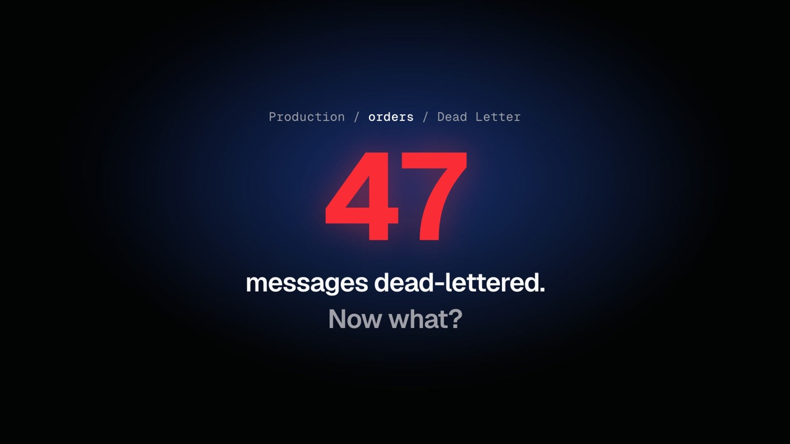
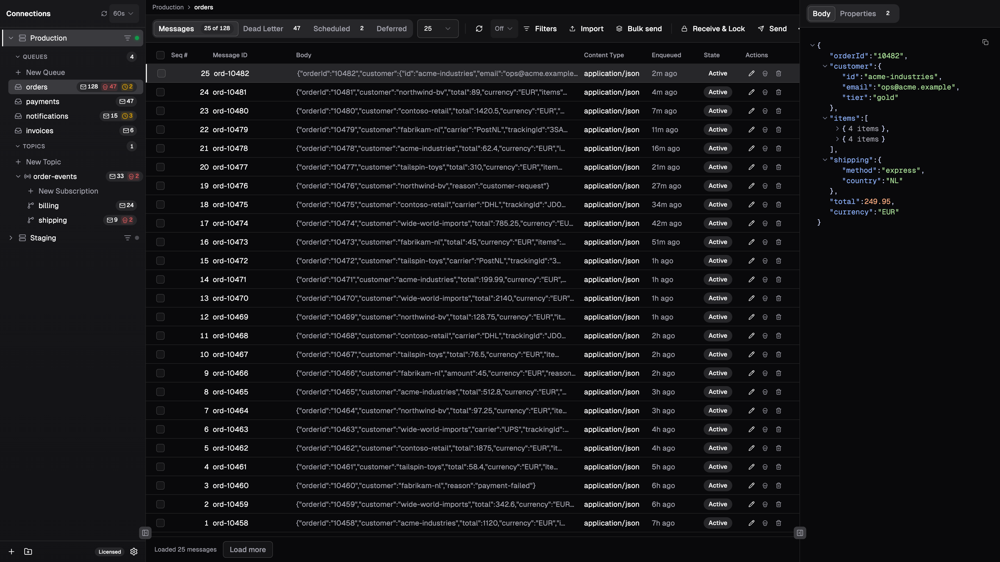
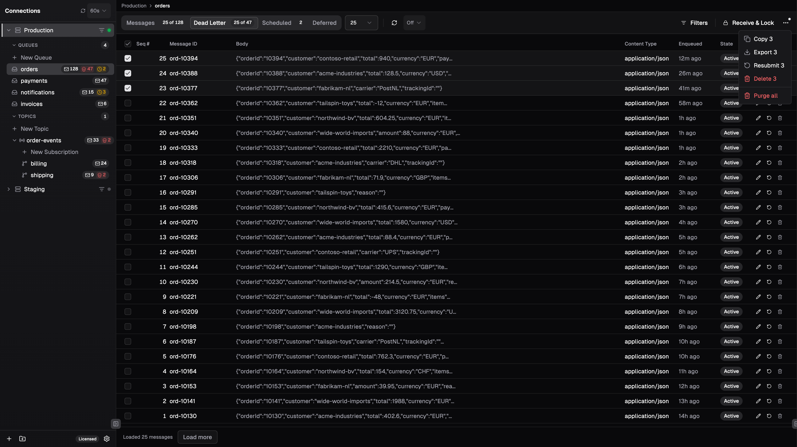
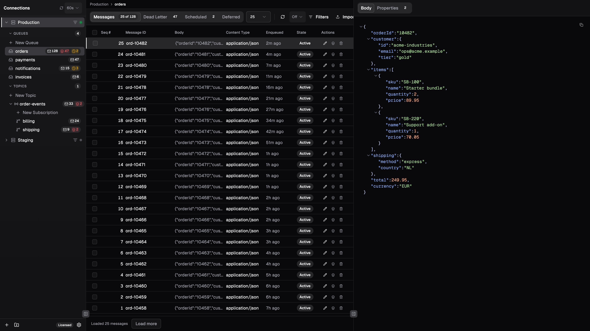
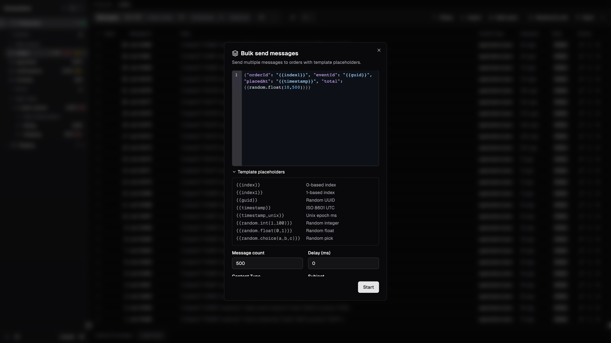
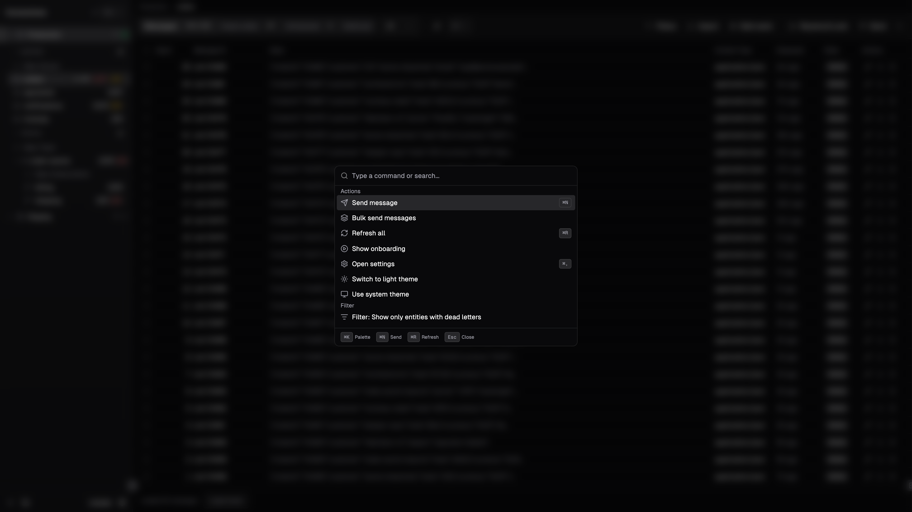
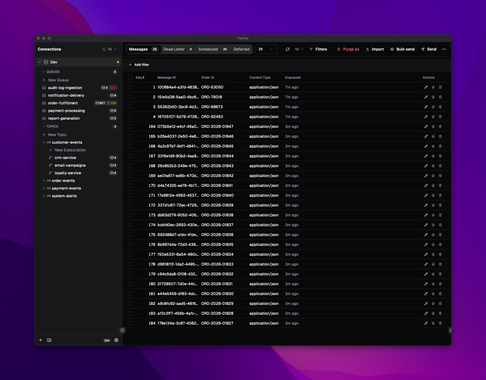
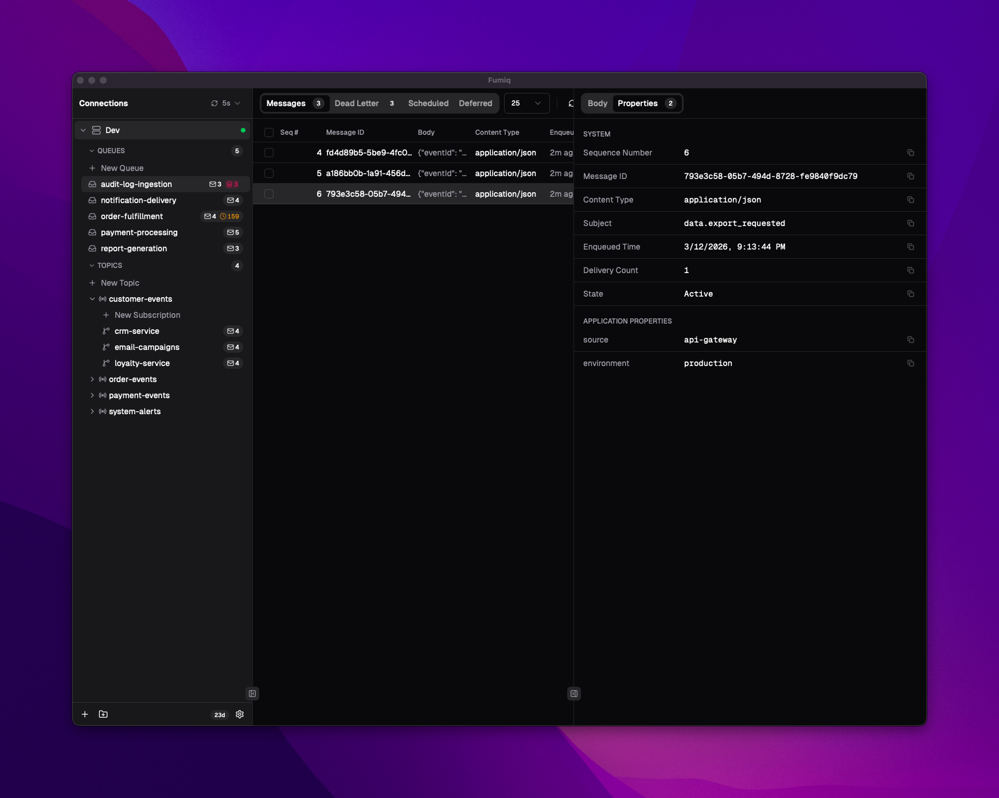
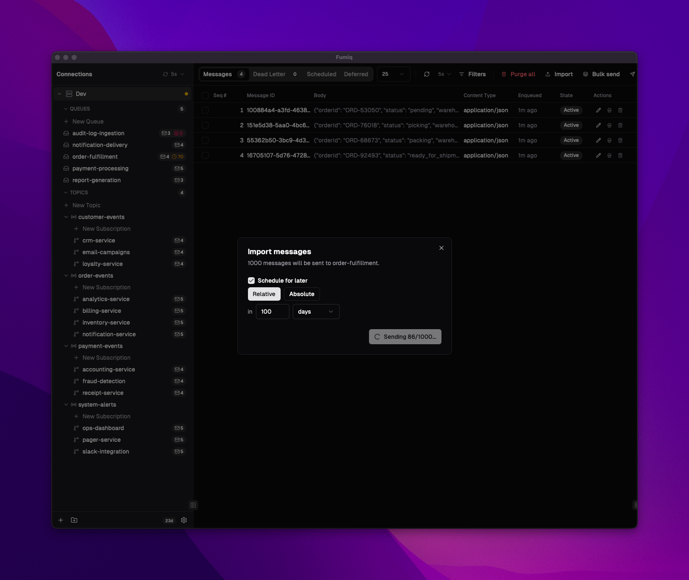
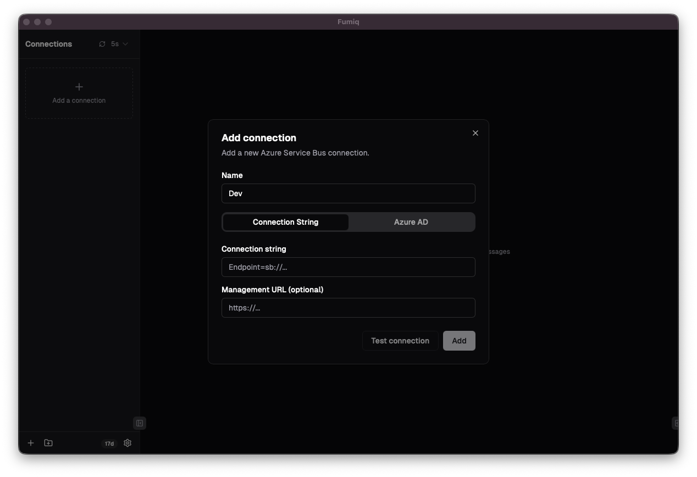

<div align="center">


# Fumiq

### The fast, visual Azure Service Bus explorer

A native desktop app for browsing queues and subscriptions, peeking and sending messages, and clearing dead-letters in seconds.

**macOS · Windows · Linux**

[**Download**](https://github.com/fschaal/fumiq-releases/releases/latest) · [Website](https://fumiq.app) · [Pricing](https://fumiq.app/#pricing) · [Changelog](https://fumiq.app/changelog)

<sub>Free 30-day trial · All features included · No credit card</sub>

<br />

<a href="https://fumiq.app/video/intro.mp4">
  
</a>

<sub>▶ <a href="https://fumiq.app/video/intro.mp4">Watch the 27-second intro</a></sub>

</div>

<br />

## Browse and peek

Browse every queue, topic, and subscription, and peek messages the moment you click.



## Repair dead-letters

Sift through what dead-lettered, then resubmit the messages that deserve another run. Edit a broken payload first if it needs fixing.



## Read a message properly

The body as a syntax-highlighted JSON or XML tree, and every system and application property beside it.



## Send with a template

Fill a queue with realistic test data from one template, hundreds of messages at a time. Placeholders like `{{index}}`, `{{guid}}` and `{{timestamp}}` make every message unique.



## Keyboard first

Reach any action, or any entity in the namespace, without leaving the keyboard. Open the command palette with `Cmd+K` / `Ctrl+K`.



## Everything else

| | |
|---|---|
| **Custom columns and filters** | Add columns from application properties or JSONPath into the body, and filter with a visual query builder. |
| **Bulk operations** | Select with checkboxes or Shift+click, then delete, dead-letter, resubmit or cancel in one go. |
| **PeekLock** | Receive and lock messages, then complete, abandon or dead-letter them with a live lock timer. |
| **Copy, export, import** | Copy messages between queues, or move them across environments as JSON files. |
| **Sessions, deferred, scheduled** | Session-aware browsing, deferred messages, and scheduled messages you can view, cancel or purge. |
| **Entity management** | Create, update and delete queues, topics, subscriptions and their filter rules. |
| **Authentication** | Connection strings or Azure AD with RBAC. Organise connections in folders. |
| **Native** | Small, fast and light on memory on every platform. |

<details>
<summary><b>More screenshots</b></summary>

<br />









</details>

## Providers

- **Azure Service Bus**: full support
- **RabbitMQ**: coming soon
- **Kafka, Amazon SQS, Google Pub/Sub**: on the horizon

## Installation

Download the latest build for your platform from the [releases page](https://github.com/fschaal/fumiq-releases/releases/latest). Fumiq updates itself after that.

## Troubleshooting

<details>
<summary><b>Linux: WebKitGTK crash on systems with Intel Arc GPUs</b></summary>

<br />

Fumiq uses WebKitGTK for rendering on Linux. On systems with Intel Arc GPUs (e.g. Intel Ultra 7/9 series), the WebKit renderer may crash due to DMA-BUF buffer sharing issues between Mesa and WebKitGTK on Wayland.

**Symptoms:** The app crashes with a `WebKitWebProcess` SIGABRT in system logs.

**Fix:** Fumiq automatically disables the DMA-BUF renderer on Linux to prevent this crash. If you're on an older version, update to the latest release.

If the crash persists, try also disabling GPU compositing by launching Fumiq with:

```bash
WEBKIT_DISABLE_COMPOSITING_MODE=1 fumiq
```

This is a known upstream issue with Intel Arc drivers and WebKitGTK, not a bug in Fumiq.

</details>

## License

Fumiq is proprietary software. See the [LICENSE](LICENSE) file for details.
